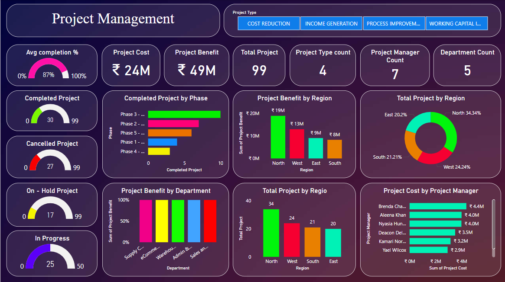
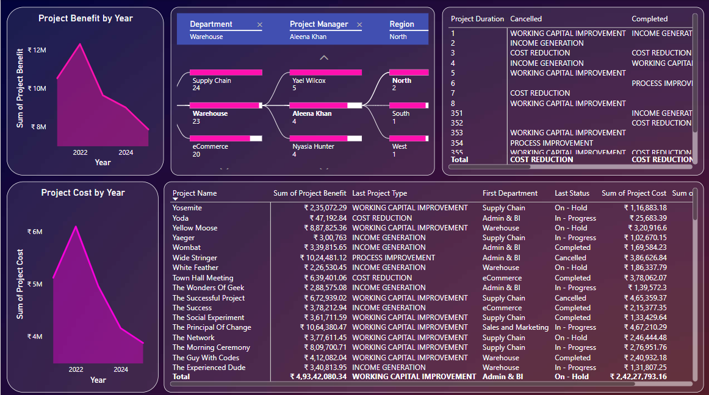

# **Project Management Dashboard**  
> A Power BI dashboard to analyze and optimize project management processes, enhancing visibility, accountability, and efficiency.

## **Table of Contents**
- [Introduction](#introduction)
- [Problem Statement](#problem-statement)
- [Objective](#objective)
- [Power BI Features Used](#power-bi-features-used)
- [Dataset Details](#dataset-details)
- [Dashboard Highlights](#dashboard-highlights)
- [Insights and Key Metrics](#insights-and-key-metrics)
- [How to Use the Dashboard](#how-to-use-the-dashboard)
- [Project Structure](#project-structure)
- [Acknowledgments](#acknowledgments)

## **Introduction**
This Power BI project provides a comprehensive solution for monitoring and managing multiple projects effectively. It is designed to support stakeholders in understanding key performance metrics, ensuring better decision-making, and fostering transparency across teams and departments.

## **Problem Statement**
Organizations often face challenges such as:
- Delayed project completion.
- Budget overruns.
- Lack of visibility into project benefits.
- Inefficiencies in resource allocation and communication.

Stakeholders struggle with evaluating performance metrics like completion rates, cost-benefit analysis, and resource allocation. These issues lead to decreased productivity, miscommunication, and poor decision-making. This dashboard addresses these challenges by providing actionable insights and enhancing project management efficiency.

## **Objective**
The objective of this project is to:
- Deliver real-time analytics for project status tracking, cost-benefit analysis, and resource allocation.
- Enhance decision-making and accountability across teams and departments.
- Foster data-driven strategies to maximize project benefits and organizational efficiency.

## **Power BI Features Used**
This dashboard leverages the following Power BI features:
- **Data Modeling:** Relationships created between `Projects`, `Resources`, and `Costs` tables.
- **DAX Measures:** Custom calculations such as:
  - `Total Costs = SUM(Costs[Amount])`
  - `Completion Rate = COUNT(Projects[Completed]) / COUNT(Projects[Total])`
  - `Cost-Benefit Ratio = SUM(Benefits[Amount]) / SUM(Costs[Amount])`
- **Visualizations:**
  - Bar charts for department-level insights.
  - Pie charts for project phase distribution.
- **Power Query Editor:** Data transformation including:
  - Removal of null values.
  - Splitting date fields into `Year` and `Month`.

## **Dataset Details**
- **Source:** The dataset was source from Kaggle.
- **Description:** The dataset consists of the following tables:
  - **Projects Table:** Details including `Project ID`, `Status`, `Phase`, `Start Date`, `End Date`, `Department`, and `Region`.
  - **Resources Table:** Information on `Resource ID`, `Name`, `Role`, and `Allocation`.
  - **Costs Table:** Cost details including `Project ID`, `Amount`, and `Category`.
- **Data Cleaning:**
  - Removed duplicates.
  - Reformatted date columns for consistency.

## **Dashboard Highlights**



The dashboard includes the following sections:
1. **Project Status Overview:** Displays KPIs for completed, in-progress, on-hold, and cancelled projects.
2. **Cost and Benefit Analysis:** Highlights cost-benefit distribution across regions and departments.
3. **Performance Insights:** Tracks performance by region, department, and project phase.
4. **Manager Accountability:** Highlights individual project manager contributions and their respective performance metrics.

## **Insights and Key Metrics**
The dashboard provides the following key insights:
- **Project Status Tracking:** Real-time updates on project completion rates.
- **Cost Efficiency:** Clear visualization of cost-benefit ratios.
- **Performance Analysis:** Identification of top-performing regions and departments.
- **Resource Utilization:** Insights into resource allocation for optimal use.

## **How to Use the Dashboard**
Follow these steps to access and interact with the dashboard:
1. Clone this repository to your local system:
   ```bash
   git clone https://github.com/Nazneenp/Project_Managment_Dashbord.git
   cd project-management-dashboard
   ```
2. Download Power BI Desktop (version 2.100 or higher).
3. Open the .pbix file in Power BI Desktop.
4. Explore the interactive visuals using slicers and filters.

## **Project Structure**
```plaintext
📦 Project_Managment_Dashbord
 ┣ 📂 data
 ┃ ┗ 📜 Project _management_dataset.xlsx
 ┣ 📜 dashboard.png
 ┣ 📜 dashboard_1.png
 ┣ 📜 dashboard.pbix
 ┣ 📜 LICENSE.txt
 ┗ 📜 README.md
```

## **Acknowledgments**
This project was made possible with:
- Internal organizational data.
- Tutorials from Microsoft Power BI Documentation.
- Contributions from cross-functional teams.
